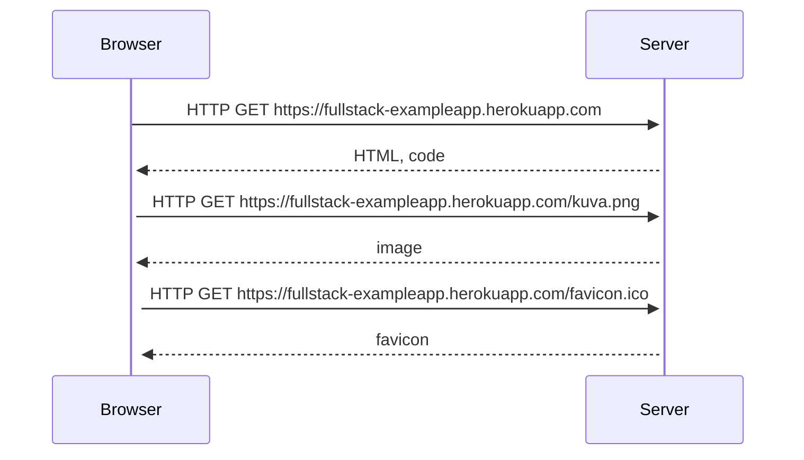

## Descripción
Se pretende dar solución a cada uno de los ejercicios propuestos

## Flujograma
Se presenta el flujo de la información del archivo ejemplo

## Tecnologías
<ul>
  <li>HTML</li>
  <li>CSS</li>
  <li>JavaScript</li>
  <li>NodeJS</li>
</ul>
